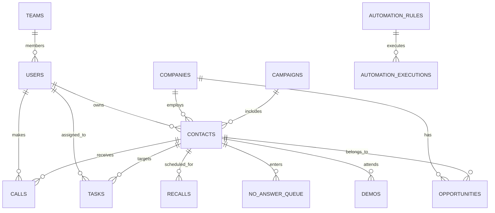

# Database Architecture & Data Integrity Guide

## 1. Relational Modeling Standard

* **Primary Keys**: Random UUIDs (`UUIDv4`) across all tables to ensure distributed safety and prevent ID enumeration attacks.
* **Timestamps**: All tables implement `created_at TIMESTAMPTZ NOT NULL DEFAULT NOW()` and `updated_at TIMESTAMPTZ NOT NULL DEFAULT NOW()`.
* **Soft Deletion**: Sensitive business entities (`users`, `companies`, `contacts`, `opportunities`, `campaigns`) implement soft deletion via `deleted_at TIMESTAMPTZ DEFAULT NULL`.
* **Foreign Keys**: Explicit `ON DELETE` actions on all foreign keys (`CASCADE` for child activities, `SET NULL` for user ownership).

## 2. Core Entities & Schema Relationship Matrix



## 3. Full-Text Search Strategy

PostgreSQL `GIN` full-text search indexing is combined with `pg_trgm` fuzzy matching to support instant search across hundreds of thousands of contacts without full table scans.

```sql
-- Search Index
CREATE INDEX idx_contacts_search_vector ON contacts USING GIN(search_vector);
CREATE INDEX idx_contacts_normalized_email ON contacts(normalized_email);
CREATE INDEX idx_contacts_normalized_phone ON contacts(normalized_phone);
```

## 4. PostgreSQL Backup & Restore Strategy

### Automated Nightly Backup
```bash
pg_dump -U crm_user -h localhost -F c -b -v -f "/backups/alphaprocrm_$(date +%Y%m%d_%H%M%S).dump" alphaprocrm
```

### Database Restore
```bash
pg_restore -U crm_user -d alphaprocrm -v "/backups/alphaprocrm_backup.dump"
```
